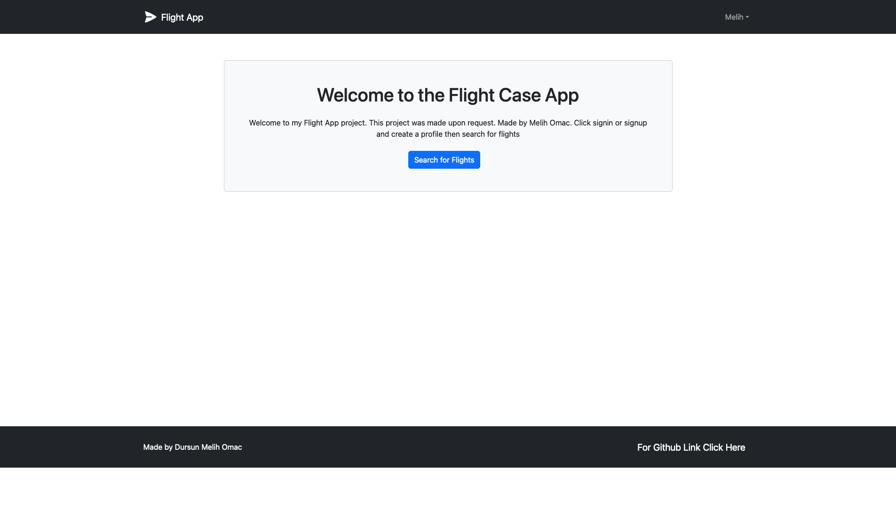
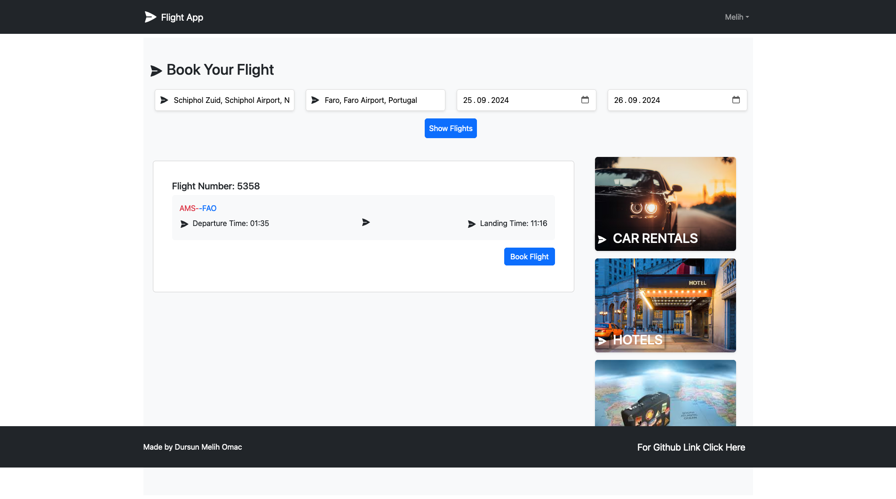
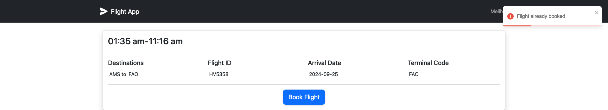

# FlightApp-Case

Welcome to my FlightApp project. This project was made upon request. You can search for flights in the project, select flights and book them in your database.

## Installation

1.  Clone the repository:

    `git clone https://github.com/Melihomac/Flight-Case   `

        cd flight-case (root)
        npm install

        cd frontend
        npm install

2.  Go to Root and create a file name `.env`

        NODE_ENV=development
        PORT=5001
        MONGO_URI={your mongodb uri}
        JWT_SECRET=abc123
        SCHIPHOL_APP_ID={your schiphol app id}
        SCHIPHOL_APP_KEY={your schiphol app key}
        API_BASE_URL=https://api.schiphol.nl

## Usage

1.  Go to Root folder and `npm run dev`

## Folder Structure

1. For FrontEnd:

   ```
   ├── README.md
   ├── eslint.config.js
   ├── index.html
   ├── package-lock.json
   ├── package.json
   ├── public
   │   └── vite.svg
   ├── src
   │   ├── App.jsx
   │   ├── assets
   │   │   ├── car.jpg
   │   │   ├── hotel.jpg
   │   │   ├── react.svg
   │   │   └── travel.jpg
   │   ├── components
   │   │   ├── CitySearch.tsx
   │   │   ├── EndDatePicker.tsx
   │   │   ├── FlightList.tsx
   │   │   ├── Footer.tsx
   │   │   ├── FormContainer.tsx
   │   │   ├── Header.tsx
   │   │   ├── Hero.tsx
   │   │   ├── Loader.tsx
   │   │   ├── PrivateRoute.tsx
   │   │   └── StartDatePicker.tsx
   │   ├── index.css
   │   ├── main.jsx
   │   ├── screens
   │   │   ├── Home.tsx
   │   │   ├── Login.tsx
   │   │   ├── MyFlights.tsx
   │   │   ├── Profile.tsx
   │   │   ├── Register.tsx
   │   │   └── UserHome.tsx
   │   ├── slices
   │   │   ├── apiSlice.tsx
   │   │   ├── authSlice.tsx
   │   │   ├── flightSlice.tsx
   │   │   ├── myflightsApiSlice.tsx
   │   │   └── usersApiSlice.tsx
   │   └── store.tsx
   └── vite.config.js
   ```

2. For Backend:

   ```
   ├── config
   │   └── db.js
   ├── controllers
   │   ├── flightController.js
   │   ├── myflightController.js
   │   └── userController.js
   ├── middleware
   │   ├── authMiddleware.js
   │   └── errorMiddleware.js
   ├── models
   │   ├── flightModel.js
   │   └── userModel.js
   ├── routes
   │   ├── destinationRoutes.js
   │   ├── flightRoutes.js
   │   └── userRoutes.js
   ├── server.js
   └── utils
    └── generateToken.js
   ```

3. All Structure:

   ```
   ├── README.md
   ├── backend
   ├── cities.json
   ├── frontend
   ├── package-lock.json
   ├── package.json
   └── public-flights-v4.json
   ```

---

# ScreenShots

## MainMenu Review



## Search for Flights



## Book Flight


